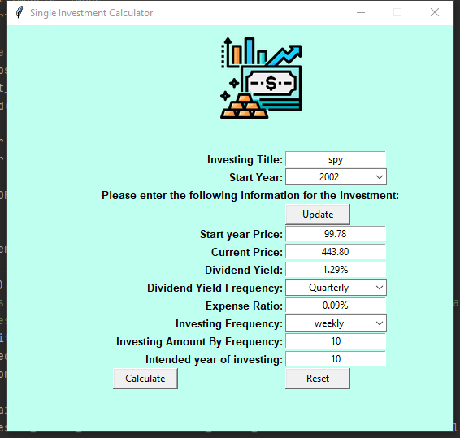
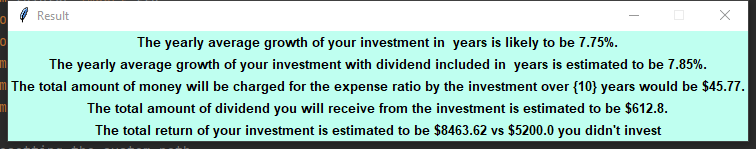
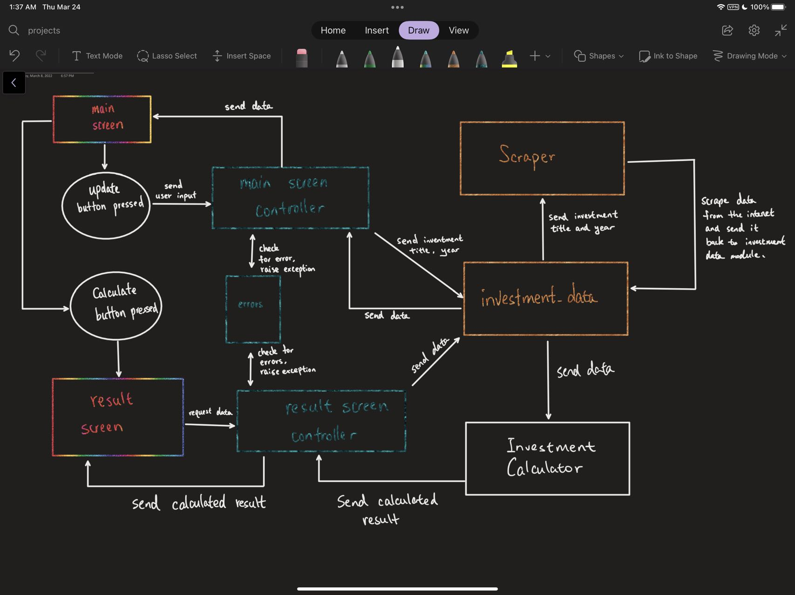

# Single Investment Calculator

This project is created to calculate an estimated investment return by inputting some data for the investment.

This project is using MVC design pattern.

In order to execute the project, please run main.py

Features of each buttons explained below:

* update button - you will need to enter investment ticker and investment start year so the program can calculate the
  annual average growth rate. The program will scrape through the internet to get some data for the investment.
* calculate button - calculates some of financial results and show them in the result screen.
* reset button - erase text in the widget.

Feature that I will work on next:  

* Better UI design.
* Use SQLite to store users input
* Create data validations in the controller file.
* Instead of single window, maybe create a multi-layer window for user to input multiple investment all at one.

Photo demonstrations are provided below:

Project outline:

image sources:

<a href="https://www.flaticon.com/free-icons/investment" title="investment icons">Investment icons created by justicon -
Flaticon</a>